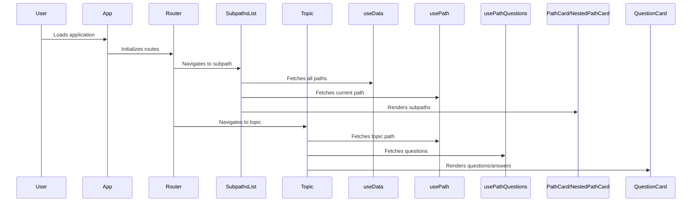

# Copilot Instructions for interview-pathway

## Project Overview

This project is a Vite + React application for interactive learning paths, featuring nested topics, subpaths, and question/answer rendering. It uses React Router for navigation and supports deep linking for any nested path.

## Key Features

- Nested learning paths and topics
- Dynamic breadcrumbs and URL navigation
- Question and answer rendering for each topic
- Progress tracking and completion badges
- Search and filter for subpaths and questions

## Folder Structure

- `src/components/` — UI components (PathCard, NestedPathCard, Header, etc.)
  - `ui/` — Shared UI primitives (button, card, badge, etc.)
  - `context/` — Context providers (AuthContext, ThemeProvider)
  - `data/` — Data helpers and static files
  - `hooks/` — Custom React hooks (useData, useProgress, use-mobile, etc.)
  - `lib/` — Utility functions (utils.tsx)
  - `pages/` — Main pages (LearningPath, Topic, SubpathsList, etc.)
  - `utils/` — Utility helpers (dataUtils, iconUtils)
- `public/` — Static assets (favicon, robots.txt, etc.)
- `assets/` — Images, diagrams, and UML documentation
- `.github/` — Project instructions and workflows
- `data/` — Static data for paths and questions
- `README.md` — Project overview and setup
- `package.json` — Project dependencies and scripts
- `vite.config.ts` — Vite configuration
- `tsconfig*.json` — TypeScript configuration

## Routing

- Uses React Router v6
- Supports arbitrary nested paths via wildcard routes
- Breadcrumbs and navigation are built from URL segments

## Coding Guidelines

- Use functional components and hooks
- Prefer context and hooks for shared state
- Use Tailwind CSS for styling
- Avoid inline styles; use classes or external CSS
- Keep link generation logic robust to avoid duplicate segments

## Copilot Usage

- Suggest code for new features using the above structure
- When editing navigation, always check for duplicate segments in URLs
- For new components, follow the naming and folder conventions
- For data fetching, use React Query and custom hooks
- For UI, use existing design system components

## Common Tasks

- Add new learning paths: update `src/data/paths/paths.json`
- Add new questions: add to `src/data/questions/`
- Add new page: create in `src/pages/` and add route in `App.tsx`
- Update breadcrumbs: edit logic in `Topic.tsx` and `LearningPath.tsx`

## Troubleshooting

- If navigation is broken, check route definitions and link generation
- If breadcrumbs are incorrect, verify URL segment parsing
- If questions/answers do not render, check data loading hooks

## Useful Prompts for Copilot

- "Generate a React Router route structure for deeply nested learning paths."
- "Show how to build breadcrumbs from URL segments in a React app."
- "Refactor link generation to avoid duplicate segments in URLs."
- "Create a PathCard and NestedPathCard component for subpaths and topics."
- "Implement progress tracking and completion badges for learning modules."
- "Add search and filter functionality for subpaths and questions."
- "Suggest a Mermaid UML diagram for the component hierarchy and data flow."
- "Show how to use React Query for data fetching and caching."
- "Add a Markdown-based documentation structure for project onboarding."
- "Implement a context provider for authentication and global state."
- "Debug why a route or breadcrumb is not working as expected."
- "Suggest best practices for organizing React components and hooks."
- "Show how to extend the design system with new UI components."
- "Add a new learning path or topic to the data structure."
- "Update the application to support arbitrary nesting in routes."
- "Create a troubleshooting checklist for navigation and data issues."

## Application Flow Diagram (Mermaid)

---

For further help, ask Copilot for code samples, refactoring, or debugging tips specific to this project.
