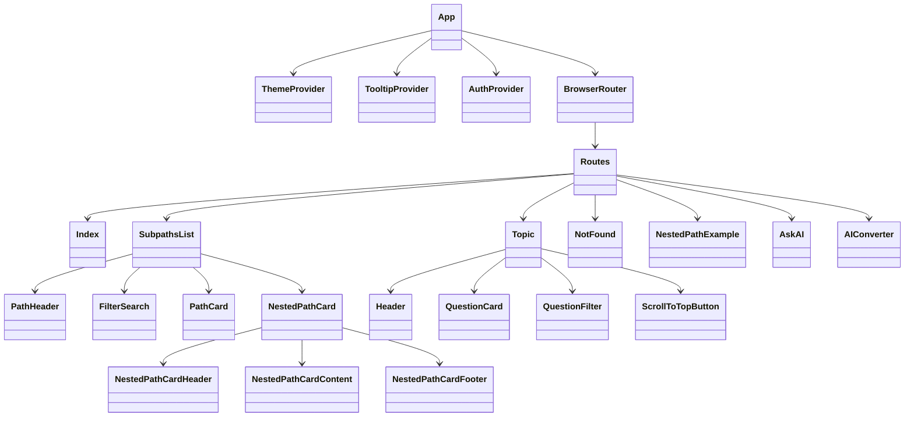
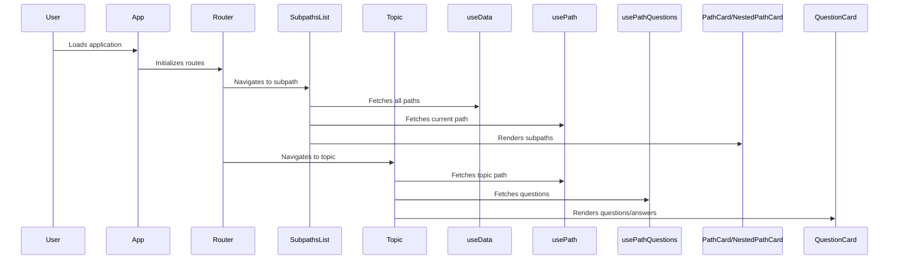

# interview-pathway UML Diagrams

## Project Structure (Component Hierarchy)

## Application Design (Data Flow)

---

For more detailed diagrams, extend the Mermaid code blocks above with additional components, hooks, or data sources as needed.
